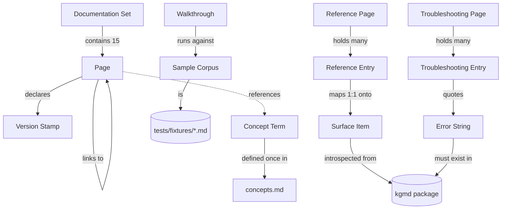

# Phase 1 Data Model: Project Documentation Set

**Feature**: [spec.md](./spec.md) | **Plan**: [plan.md](./plan.md) | **Date**: 2026-08-28

This feature's "data" is content, not runtime state. The model below defines the content entities,
their required fields, their relationships, and — critically — which validation rules are
**mechanically enforced** by `tests/test_docs.py` versus enforced by review. Nothing here introduces
database schema; Constitution Principle I is untouched.

## Entity overview

## 1. Documentation Set

The complete body of pages under `docs/`.

| Field | Type | Rule |
|---|---|---|
| `root` | directory | MUST be `docs/` at repository root (FR-001) |
| `index` | Page | MUST be `docs/README.md`; exactly one (FR-002) |
| `pages` | Page[] | 15 pages at the paths fixed in plan.md's structure |
| `max_depth` | int | MUST be ≤ 2 directory levels below `docs/` (SC-006) |

**Enforced**: index exists; every `docs/**/*.md` is reachable from the index within 2 links; no page
sits deeper than `docs/<dir>/<page>.md`.

**Relationships**: one Documentation Set per repository, versioned with the package. Its authority
boundary against `README.md` is defined by FR-003 — README orients, the set specifies.

## 2. Page

| Field | Type | Rule |
|---|---|---|
| `path` | path | `docs/**/*.md` |
| `title` | string | MUST be the first line, a single `# ` H1 |
| `version_stamp` | Version Stamp | MUST be line 2 (FR-004) |
| `intent_group` | enum | one of `entry`, `guide`, `reference`, `example`, `contributing` — derived from location |
| `outbound_links` | Link[] | every internal target MUST resolve on disk (FR-042) |

**Enforced**: H1 on line 1; stamp on line 2 matching the package minor version; all internal links
and file references resolve; no page orphaned from the index.

**Not enforced (review-owned)**: prose quality, audience fit, whether the explanation is *good*.

## 3. Version Stamp

| Field | Type | Rule |
|---|---|---|
| `text` | string | exactly `> Applies to kgmd <MAJOR>.<MINOR>.x` |
| `major_minor` | string | MUST equal `major.minor` of `kgmd.__version__` (currently `0.1`) |

**Enforced**: exact regex match on every page; mismatch fails the suite. A version bump therefore
fails the build until all 15 stamps are updated — the intended forcing function (FR-004).

## 4. Surface Item (derived, not authored)

A single user-visible unit of the tool, introspected at test time. This is the authority against
which documentation is measured; it is never hand-maintained.

| Field | Type | Source of truth |
|---|---|---|
| `kind` | enum | `command`, `global_option`, `parameter`, `config_key`, `mcp_tool`, `export_format` |
| `identifier` | string | see [contracts/documented-surface.md](./contracts/documented-surface.md) |
| `parent` | string? | for `parameter`, the owning command |

Current population (verified 2026-08-28 against `kgmd` 0.1.0): 16 commands, 1 global option, 49
parameters (9 arguments + 40 options), 19 config keys, 7 MCP tools, 3 export formats.

## 5. Reference Entry

An authored documentation unit that MUST correspond to exactly one Surface Item.

| Field | Type | Rule |
|---|---|---|
| `identifier` | string | MUST match a Surface Item identifier exactly |
| `page` | Page | fixed by kind: commands/parameters → `docs/reference/cli.md`; config keys → `docs/reference/configuration.md`; MCP tools → `docs/guides/mcp.md`; export formats → `docs/reference/export.md` |
| `anchor` | heading | commands: `### <name>`; config keys and tools: table row with the identifier in an inline code span |
| `purpose` | prose | required, one sentence minimum |
| `default` | string | required for config keys and options carrying a default |
| `accepted_values` | string | required where constrained (e.g. `split_on`, `--format`) |
| `example` | code block | required for every command entry (FR-012) |
| `status` | enum | `active` \| `inert` — `inert` required for the three keys with no effect (FR-017) |

**Enforced bidirectionally** (FR-041):
- every Surface Item has a Reference Entry → no undocumented surface;
- every Reference Entry names a real Surface Item → no phantom documentation.

The second direction is what would have caught the 6 wrong MCP tool names in today's README.

**State transition**: when a Surface Item disappears from the code, its Reference Entry becomes
invalid and the suite fails until the entry is removed — documentation cannot outlive its subject.

## 6. Structured-Output Capability

| Field | Type | Rule |
|---|---|---|
| `command` | string | one of the 8 commands exposing an `as_json` parameter |
| `documented` | bool | its CLI entry MUST show both human and structured forms (FR-014) |

**Enforced**: the set of commands whose entry contains a documented `--json` usage MUST equal the
introspected `as_json` set exactly — currently `stats`, `find`, `entities`, `relations`, `entity`,
`neighbors`, `path`, `schema`.

## 7. Troubleshooting Entry

| Field | Type | Rule |
|---|---|---|
| `symptom` | string | line starting `**Symptom**:` containing the quoted error prefix in an inline code span |
| `error_prefix` | string | literal source text up to the first interpolation (R-007); MUST appear verbatim in some `kgmd/**/*.py` |
| `cause` | prose | required |
| `fix` | prose | required, with commands where applicable |

**Enforced**: every quoted `error_prefix` exists in the package source. Prevents the page drifting
into quoting messages the tool no longer emits.

**Required minimum population** (FR-030), all seven mapped to real raise sites: missing provider
credential; interpreter without loadable-extension support; command run outside a corpus
(`No .kgmd directory found`); database absent (`Database not found:`); embedding-model mismatch
(`Database was initialized with embedding model`); build blocked by another build; unparseable
provider response; zero-entity build.

## 8. Walkthrough

| Field | Type | Rule |
|---|---|---|
| `goal` | prose | required, first section |
| `prerequisites` | list | required; MUST state whether a git checkout is needed |
| `corpus` | Sample Corpus | required |
| `commands` | ordered code blocks | required, copy-pasteable (FR-034) |
| `expected_output` | code block or prose | required; exact counts permitted **only** for the fixture corpus path |
| `limitations` | prose | required (FR-033) |
| `credentials` | reference | MUST appear only as an environment variable with a placeholder value (FR-035) |

**Enforced**: no walkthrough contains a string matching a plausible real key (e.g. `sk-` followed by
20+ characters); every referenced fixture filename exists.

**Population**: exactly three (FR-032) — `personal-notes.md`, `mcp-assistant.md`,
`graph-export.md`.

## 9. Sample Corpus

| Field | Type | Rule |
|---|---|---|
| `location` | path | `tests/fixtures/*.md` — the single canonical corpus (R-005) |
| `files` | 7 files | `acme_corp.md`, `brian_anderson.md`, `digital_transformation.md`, `partnerships.md`, `quarterly_review.md`, `sarah_chen.md`, `tech_stack.md` |
| `alias_variants` | required | MUST retain the deliberate alias spellings the resolution tests depend on |
| `pypi_fallback` | inline heredoc | the quickstart MUST provide a checkout-free two-note corpus |

**Enforced**: referenced filenames exist. **Not duplicated** into `docs/` — a second copy would
drift from the counts the existing tests pin.

## 10. Concept Term

| Field | Type | Rule |
|---|---|---|
| `term` | string | one of: document, chunk, entity, mention, relation, induced schema |
| `definition` | prose | defined exactly once, in `docs/concepts.md` (FR-021) |

**Enforced**: each of the six terms appears as a definition heading in `concepts.md`. Other pages
link rather than redefine, so vocabulary cannot fork.

## Validation summary

| Rule | Source requirement | Mechanism |
|---|---|---|
| Bidirectional surface coverage | FR-041, SC-002 | `tests/test_docs.py` introspection |
| Internal links resolve | FR-042 | filesystem resolution, offline |
| Version stamp currency | FR-004 | regex vs `kgmd.__version__` |
| Quoted errors exist in source | FR-031 | substring search over `kgmd/**/*.py` |
| Structured-output parity | FR-014 | `as_json` set equality |
| No credential-shaped strings | FR-035 | regex over `docs/**/*.md` |
| Fixture references exist | FR-034 | filesystem check |
| Two-link reachability | SC-006 | link-graph BFS from `docs/README.md` |
| Examples actually run | FR-043, SC-004 | **manual**, pre-release checklist (R-006) |
| Prose accuracy and usefulness | SC-001, SC-003, SC-009 | **manual**, reviewer-owned |
